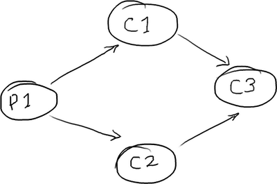
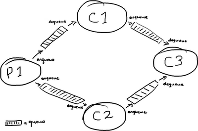
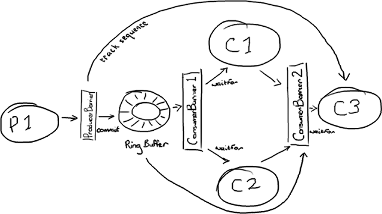
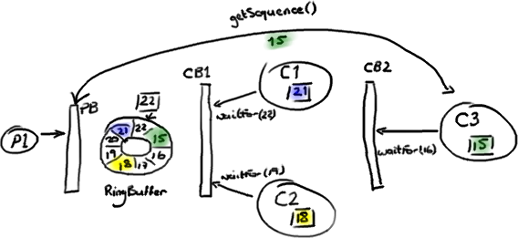
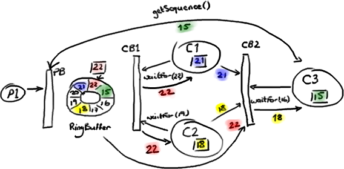
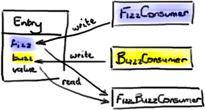

#解析 Disruptor 的依赖关系
原文地址：<http://ifeve.com/dissecting-disruptor-wiring-up/>

作者：Trisha   译者：廖涵  校对：方腾飞

现在我已经讲了 [RingBuffer​](http://ifeve.com/dissecting-disruptor-whats-so-special/) 本身，如何从它 读取​ 以及如何向它 写入​。从逻辑上来说，下一件要做的事情就是把所有的东西拼装到在一起。

我前面提到过多生产者的情况——他们通过 ProducerBarrier 保证写入操作顺序与可控。我也提到过简单场景下的多消费者数据访问。更多的消费者的场景会变得更加复杂，[我们](http://www.lmaxtrader.co.uk/)​实现了一些聪明的机制允许多个消费者在访问 Ring Buffer 的时候互相等待（依赖）。像很多应用里，有一连串的工作需要在实际执行业务逻辑之前完成 (happen before) —— 例如，在做任何操作之前，我们都必须先保证消息写入磁盘。

[Disruptor 论文](http://disruptor.googlecode.com/files/Disruptor-1.0.pdf)​和性能测试里包含了你可能想到的一些基本结构。我准备讲一下其中最有趣的那个，这多半是因为我需要练习如何使用画图板。

##菱形结构

[DiamondPath1P3CPerfTest](http://code.google.com/p/disruptor/source/browse/trunk/code/src/perf/com/lmax/disruptor/DiamondPath1P3CPerfTest.java)​ 展示了一个并不罕见的结构——独立的一个生产者和三个消费者。最棘手的一点是：第三个消费者必须等待前两个消费者处理完成后，才能开始工作。



消费者 C3 也许是你的业务逻辑。消费者 C1 可能在备份接收到的数据，而消费者 C2 可能在准备数据或者别的东西。

##用队列实现菱形结构

在一个 [SEDA-风格的架构](http://www.theserverside.com/news/1363672/Building-a-Scalable-Enterprise-Applications-Using-Asynchronous-IO-and-SEDA-Model)​中，每个处理阶段都会用队列分开：



（为什么单词 Queue 里必须有这么多 “e” 呢？这是我在画这些图时遇到的最麻烦的词）。

你也许从这里看到了问题的端倪：一条消息从 P1 传输到 C3 要完整的穿过四个队列，每个队列在消息进入队列和取出队列时都会产生消耗成本。

##用 Disruptor 实现菱形结构

在 Disruptor​ 的世界里，一切都由一个单独的 Ring Buffer 管理：



这张图看起来更复杂。不过所有的参与者都只依赖 Ring Buffer 作为一个单独的联结点，而且所有的交互都是基于 Barrier 对象与检查依赖的目标序号来实现的。

生产者这边比较简单，它是我在 上文​ 中描述过的单生产者模型。有趣的是，生产者并不需要关心所有的消费者。它只关心消费者 C3，如果消费者 C3 处理完了 Ring Buffer 的某一个节点，那么另外两个消费者肯定也处理完了。因此，只要 C3 的位置向前移动，Ring Buffer 的后续节点就会空闲出来。

管理消费者的依赖关系需要两个 ConsumerBarrier 对象。第一个仅仅与 Ring Buffer 交互，C1 和 C2 消费者向它申请下一个可访问节点。第二个 ConsumerBarrier 只知道消费者 C1 和 C2，它返回两个消费者访问过的消息序号中较小的那个。

##Disruptor 怎样实现消费者等待（依赖）

Hmmm。我想需要一个例子。



我们从这个故事发生到一半的时候来看：生产者 P1 已经在 Ring Buffer 里写到序号 22 了，消费者 C1 已经访问和处理完了序号 21 之前的所有数据。消费者 C2 处理到了序号 18。消费者 C3，就是依赖其他消费者的那个，才处理到序号 15。

生产者 P1 不能继续向 RingBuffer 写入数据了，因为序号 15 占据了我们想要写入序号 23 的数据节点 (Slot)。



（抱歉，我真的试过用其他颜色来代替红色和绿色，但是别的都更容易混淆。）

第一个 ConsumerBarrier（CB1）告诉 C1 和 C2 消费者可以去访问序号 22 前面的所有数据，这是 Ring Buffer 中的最大序号。第二个 ConsumerBarrier (CB2) 不但会检查 RingBuffer 的序号，也会检查另外两个消费者的序号并且返回它们之间的最小值。因此，三号消费者被告知可以访问 Ring Buffer 里序号 18 前面的数据。

注意这些消费者还是直接从 Ring Buffer 拿数据节点——并不是由 C1 和 C2 消费者把数据节点从 Ring Buffer 里取出再传递给 C3 消费者的。作为替代的是，由第二个 ConsumerBarrier 告诉 C3 消费者，在 RingBuffer 里的哪些节点可以安全的处理。

这产生了一个问题——如果任何数据都来自于 Ring Buffer，那么 C3 消费者如何读到前面两个消费者处理完成的数据呢？如果 C3 消费者关心的只是先前的消费者是否已经完成它们的工作（例如，把数据复制到别的地方），那么这一切都没有问题—— C3 消费者知道工作已完成就放心了。但是，如果 C3 消费者需要访问先前的消费者的处理结果，它又从哪里去获取呢？

##更新数据节点

秘密在于把处理结果写入 Ring Buffer 数据节点 (Entry) 本身。这样，当 C3 消费者从 Ring Buffer 取出节点时，它已经填充好了 C3 消费者工作需要的所有信息。这里 真正 重要的地方是节点 (Entry) 对象的每一个字段应该只允许一个消费者写入。这可以避免产生并发写入冲突 (write-contention) 减慢了整个处理过程。



你可以在 [DiamondPath1P3CPerfTest​](http://code.google.com/p/disruptor/source/browse/trunk/code/src/perf/com/lmax/disruptor/DiamondPath1P3CPerfTest.java) 里看到这个例子—— [FizzBuzzEntry​](http://code.google.com/p/disruptor/source/browse/trunk/code/src/perf/com/lmax/disruptor/support/FizzBuzzEntry.java) 有两个字段：fizz 和 buzz。如果消费者是 Fizz Consumer, 它只写入字段 fizz。如果是 Buzz Consumer, 它只写入字段 buzz。第三个消费者 FizzBuzz，它只去读这两个字段但是不会做写入，因为读没问题，不会引起争用。

##一些实际的 Java 代码

这一切看起来都要比队列实现更复杂。是的，它涉及到更多的内部协调。但是这些细节对于消费者和生产者是隐藏的，它们只和 Barrier 对象交互。诀窍在消费者结构里。上文例子中提到的菱形结构可以用下面的方法创建：

```

  ConsumerBarrier consumerBarrier1 =
        ringBuffer.createConsumerBarrier(); BatchConsumer consumer1 =
        new BatchConsumer(consumerBarrier1, handler1); BatchConsumer consumer2 =
        new BatchConsumer(consumerBarrier1, handler2); ConsumerBarrier consumerBarrier2 =
        ringBuffer.createConsumerBarrier(consumer1, consumer2); BatchConsumer consumer3 =
        new BatchConsumer(consumerBarrier2, handler3); ProducerBarrier producerBarrier =
        ringBuffer.createProducerBarrier(consumer3);

```

##总结

现在你知道了——如何关联 Disruptor 与相互依赖（等待）的多个消费者。关键点是：

 * 使用多个 ConsumerBarrier 来管理消费者之间的依赖（等待）关系。
*  使用 ProducerBarrier 监视结构图中最后一个消费者。
 * 只允许一个消费者更新数据节点 (Entry) 的每一个独立字段。


更新：Adrian 写了一个非常好的 [DSL](http://www.symphonious.net/2011/07/11/lmax-disruptor-high-performance-low-latency-and-simple-too/) 工具让拼接 Disruptor 更加简单了。

更新 2：注意 Disruptor 2.0 版使用了与本文不一样的命名。如果你对类名感到困惑，请阅读我的[变更总结](http://ifeve.com/disruptor-2-change/)​​。另外，Adrian 的 DSL 工具现在是 Disruptor 主干代码的一部分了。

原创文章，转载请注明： 转载自[并发编程网 – ifeve.com](http://ifeve.com/)

本文链接地址: [解析Disruptor的依赖关系](http://ifeve.com/dissecting-disruptor-wiring-up-cn/)
