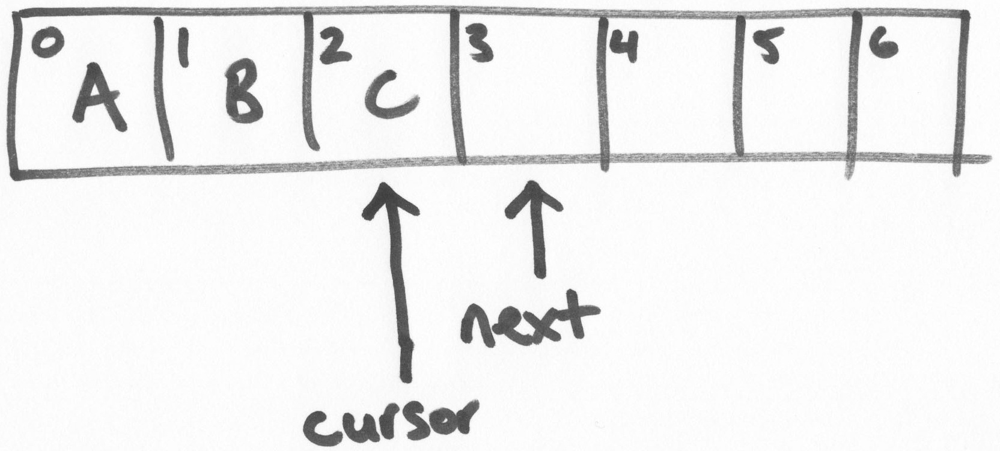
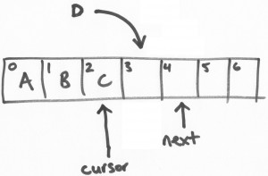
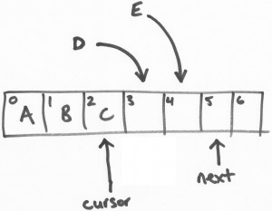
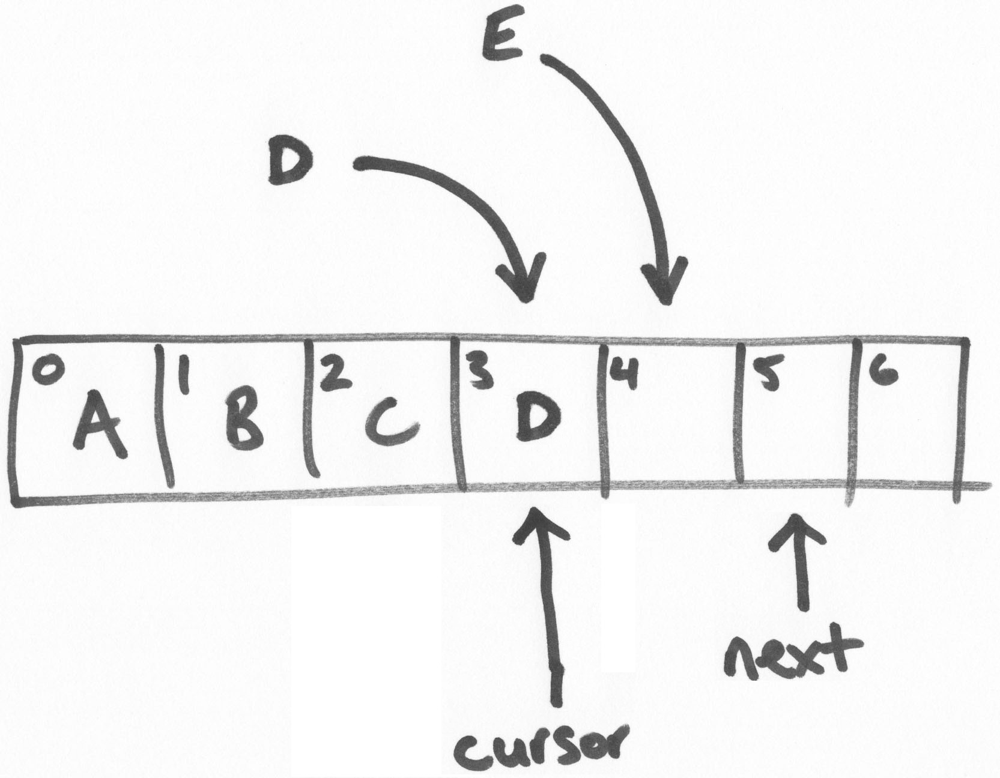
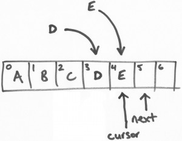

#Disruptor(无锁并发框架)-发布

原文：<http://blog.codeaholics.org/2011/the-disruptor-lock-free-publishing/>

译者：罗立树

假如你生活在另外一个星球，我们最近开源了一套高性能的基于消息传递的开源框架。

下面我给大家介绍一下如何将消息通过 Ring buffer 在无锁的情况下进行处理。

在深入介绍之前，可以先快速阅读一下 [Trish 发表的文章](http://ifeve.com/dissecting-disruptor-whats-so-special/)，该文章介绍了 ring buffer 和其工作原理。

这篇文章的要点如下：

1.ring buffer 是由一个大数组组成的。

2.所有 ring buffer 的“指针”（也称为序列或游标）是 java long 类型的（64位有符号数），指针采用往上计数自增的方式。（不用担心越界，即使每秒 1,000,000 条消息，也要消耗 300,000 年才可以用完）。

3.对 ring buffer 中的指针进行按 ring buffer 的 size 取模找出数组的下标来定位入口（类似于 HashMap 的 entry）。为了提高性能，我们通常将 ring buffe r的 size 大小设置成实际使用的2倍。

这样我们可以通过位运算(bit-mask )的方式计算出数组的下标。

##Ring buffer 的基础结构

注意：和代码中的实际实现，我这里描述的内容是进行了简化和抽象的。从概念上讲，我认为更加方面理解。

ring buffer维护两个指针，“next”和“cursor”。

在上面的图示里，是一个 size 为 7 的 ring buffer（你应该知道这个手工绘制的图示的原理），从 0-2 的坐标位置是填充了数据的。

“next”指针指向第一个未填充数据的区块。“cursor”指针指向最后一个填充了数据的区块。在一个空闲的 ring bufer 中，它们是彼此紧邻的，如上图所示。

##填充数据（Claiming a slot，获取区块）

Disruptor API 提供了事务操作的支持。当从 ring buffe r获取到区块，先是往区块中写入数据，然后再进行提交的操作。

假设有一个线程负责将字母“D”写进ring buffer中。将会从 ring buffer中获取一个区块（slot）,这个操作是一个基于CAS的“get-and-increment”操作，将“next”指针进行自增。这样，当前线程（我们可以叫做线程D）进行了 get-and-increment 操作后，

指向了位置 4，然后返回 3。这样，线程 D 就获得了位置3的操作权限。

接着，另一个线程E做类似以上的操作。

##提交写入

以上，线程 D 和线程 E 都可以同时线程安全的往各自负责的区块（或位置，slots）写入数据。但是，我们可以讨论一下线程 E 先完成任务的场景…

线程E尝试提交写入数据。在一个繁忙的循环中有若干的 CAS 提交操作。线程E持有位置 4，它将会做一个 CAS 的 waiting 操作，直到  “cursor”变成 3，然后将“cursor”变成 4。

再次强调，这是一个原子性的操作。因此，现在的 ring buffer中，“cursor”现在是 2，线程E将会进入长期等待并重试操作，直到 “cursor”变成 3。

然后，线程 D 开始提交。线程 E 用 CAS 操作将“cursor”设置为 3（线程E持有的区块位置）当且仅当“cursor”位置是2.“cursor”当前是 2，所以 CAS 操作成功和提交也成功了。

这时候，“cursor”已经更新成 3，然后所有和3相关的数据变成可读。

这是一个关键点。知道 ring buffer 填充了多少 – 即写了多少数据，那一个序列数写入最高等等，是游标的一些简单的功能。“next”指针是为了保证写入的事务特性。

最后的疑惑是线程E的写入可见，线程E一直重试，尝试将“cursor”从 3 更新成 4，经过线程D操作后已经更新成 3，那么下一次重试就可以成功了。

总结

写入数据可见的先后顺序是由线程所抢占的位置的先后顺序决定的，而不是由它的提交先后决定的。但你可以想象这些线程从网络层中获取消息，这是和消息按照时间到达的先后顺序是没什么不同的，而两个线程竞争获取一个不同循序的位置。

因此，这是一个简单而优雅的算法，写操作是原子的，事务性和无锁，即使有多个写入线程。

原创文章，转载请注明： [转载自并发编程网 – ifeve.com](http://ifeve.com/)

本文链接地址: [Disruptor(无锁并发框架)-发布](http://ifeve.com/the-disruptor-lock-free-publishing/)
