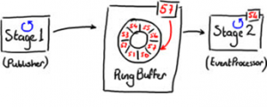
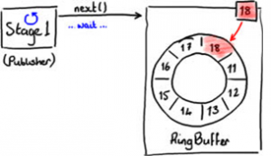
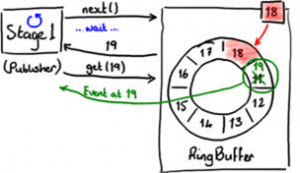
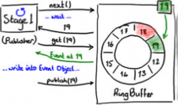
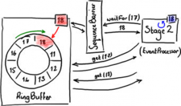
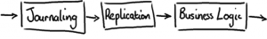
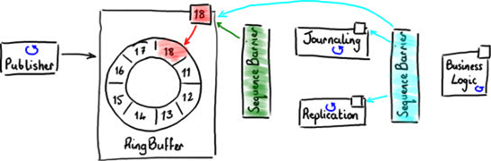
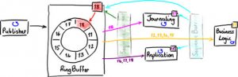

#线程间共享数据无需竞争
[原文地址](http://ifeve.com/?p=3584)  作者  Trisha   译者：李同杰

LMAX Disruptor 是一个开源的并发框架，并获得 [2011 Duke’s](http://www.java.net/dukeschoice) 程序框架创新奖。本文将用图表的方式为大家介绍 Disruptor 是什么，用来做什么，以及简单介绍背后的实现原理。

##Disruptor 是什么？

Disruptor 是线程内通信框架，用于线程里共享数据。LMAX 创建Disruptor 作为可靠消息架构的一部分并将它设计成一种在不同组件中共享数据非常快的方法。
基于 Mechanical Sympathy（对于计算机底层硬件的理解），基本的计算机科学以及领域驱动设计，Disruptor 已经发展成为一个帮助开发人员解决很多繁琐并发编程问题的框架。
很多架构都普遍使用一个队列共享线程间的数据（即传送消息）。图1 展示了一个在不同的阶段中通过使用队列来传送消息的例子（每个蓝色的圈代表一个线程）。

图 1

这种架构允许生产者线程（图1中的 stage 1）在 stage2 很忙以至于无法立刻处理的时候能够继续执行下一步操作，从而提供了解决系统中数据拥堵的方法。这里队列可以看成是不同线程之间的缓冲。

在这种最简单的情况下，Disruptor 可以用来代替队列作为在不同的线程传递消息的工具（如图 2 所示）。

图2

这种数据结构叫着 RingBuffer，是用数组实现的。Stage1 线程把数据放进 RingBuffer，而 Stage2 线程从 RingBuffer 中读取数据。

图2 中，可以看到 RingBuffer 中每格中都有序号，并且 RingBuffer 实时监测值最大（最新）的序号，该序号指向 RingBuffer 中最后一格。序号会伴随着越来越多的数据增加进 RingBuffer 中而增长。

Disruptor 的关键在于是它的设计目标是在框架内没有竞争.这是通过遵守single-writer 原则，即只有一块数据可以写入一个数据块中，而达到的。遵循这样的规则使得 Disruptor 避免了代价高昂的 CAS 锁，这也使得 Disruptor 非常快。

Disruptor 通过使用 RingBuffer 以及每个事件处理器（EventProcessor）监测各自的序号从而减少了竞争。这样，事件处理器只能更新自己所获得的序号。当介绍向 RingBuffer 读取和写入数据时会对这个概念作进一步阐述。

##发布到 Disruptor

向 RingBuffer 写入数据需要通过两阶段提交（two-phase commit）。首先，Stage 1线程即发布者必须确定 RingBuffer 中下一个可以插入的格,如图 3 所示。

图 3

RingBuffer 持有最近写入格的序号（图3中的18格），从而确定下一个插入格的序号。

RingBuffer 通过检查所有事件处理器正在从 RingBuffe 中读取的当前序号来判断下一个插入格是否空闲。

图4显示发现了下一个插入格。

图 4

当发布者得到下一个序号后，它可以获得该格中的对象，并可以对该对象进行任意操作。你可以把格想象成一个简单的可以写入任意值的容器。

同时，在发布者处理 19 格数据的时候，RingBuffer 的序号依然是 18，所以其他事件处理器将不会读到19格中的数据。

图5表示对象的改动保存进了 RingBuffer。

图5

最终，发布者最终将数据写入19 格后，通知 RingBuffer 发布 19 格的数据。这时，RingBuffer 更新序号并且所有从 RingBuffer 读数据的事件处理器都可以看到 19 格中的数据。

##RingBuffer 中数据读取

Disruptor 框架中包含了可以从 RingBuffer 中读取数据的BatchEventProcessor，下面将概述它如何工作并着重介绍它的设计。

当发布者向 RingBuffer 请求下一个空格以便写入时，一个实际上并不真的从 RingBuffer 消费事件的事件处理器，将监控它处理的最新的序号并请求它所需要的下一个序号。

图5显示事件处理器等待下一个序号。

图6

事件处理器不是直接向 RingBuffer 请求序号，而是通过 SequenceBarrie r向 RingBuffer 请求序号。其中具体实现细节对我们的理解并不重要，但是下面可以看到这样做的目的很明显。

如图 6 中 Stage2 所示，事件处理器的最大序号是 16.它向 SequenceBarrier 调用 waitFor（17）以获得 17 格中的数据。因为没有数据写入 RingBuffer，Stage2 事件处理器挂起等待下一个序号。如果这样，没有什么可以处理。但是，如图6所示的情况，RingBuffer 已经被填充到 18 格，所以 waitFor 函数将返回18并通知事件处理器，它可以读取包括直到 18 格在内的数据，如图7所示。

图7

这种方法提供了非常好的批处理功能，可以在 BatchEventProcessor 源码中看到。源码中直接向 RingBuffer 批量获取从下一个序号直到最大可以获得的序号中的数据。

你可以通过实现 EventHandler 使用批处理功能。在 Disruptor 性能测试中有关于如何使用批处理的例子，例如 FizzBuzzEventHandler。

##是低延迟队列？

当然，Disruptor 可以被当作低延迟队列来使用。我们对于 Disruptor 之前版本的测试数据显示了，运行在一个 2.2 GHz 的英特尔酷睿 i7-2720 QM 处理器上使用 Java 1.6.0_25 64位的 Ubuntu 的 11.04 三层管道模式架构中，Disruptor 比 ArrayBlockingQueue 快了多少。表1显示了在管道中的每跳延迟。有关此测试的更多详细信息，请参阅 Disruptor 技术文件。

但是不要根据延迟数据得出 Disruptor 只是一种解决某种特定性能问题的方案，因为它不是。

##更酷的东西

一个有意思的事是 Disruptor 是如何支持系统组件之间的依赖关系，并在线程之间共享数据时不产生竞争。

Disruptor 在设计上遵守 single-writer 原则从而实现零竞争，即每个数据位只能被一个线程写入。但是，这不代表你不可以使用多个线程读数据，而这正是 Disrupto r所支持的。

Disruptor 系统的最初设计是为了支持需要按照特定的顺序发生的阶段性类似流水线事件，这种需求在企业应用系统开发中并不少见。图 8 显示了标准的 3 级流水线。

图 8

首先，每个事件都被写入硬盘（日志）作为日后恢复用。其次，这些事件被复制到备份服务器。只有在这两个阶段后，系统开始业务逻辑处理。

按顺序执行上次操作是一个合乎逻辑的方法，但是并不是最有效的方法。日志和复制操作可以同步执行，因为他们互相独立。但是业务逻辑必须在他们都执行完后才能执行。图9显示他们可以并行互不依赖。

图 9

如果使用 Disruptor，前两个阶段（日志和复制）可以直接从 RingBuffer中读取数据。正如图7种的简化图所示，他们都使用一个单一的Sequence Barrier从RingBuffer 获取下一个可用的序号。他们记录他们使用过的序号，这样他们知道那些事件已经读过并可以使用 BatchEventProcessor 批量获取事件。

业务逻辑同样可以从同一个 RingBuffer 中读取事件，但是只限于前两个阶段已经处理过事件。这是通过加入第二个 SequenceBarrier 实现的，用它来监控处理日志的事件处理器和复制的事件处理器，当请求最大可读的序号时，它返回两个处理器中较小的序号。

当每个事件处理器都使用 SequenceBarrier 来确定哪些事件可以安全的从 RingBuffer 中读出，那么就从中读出这些事件。

图10

有很多事件处理器都可以从 RingBuffer 中读取序号，包括日志事件处理器，复制事件处理器等，但是只有一个处理器可以增加序号。这保证了共享数据没有竞争。

##如果有多个发布者？

Disruptor 也支持多个发布者向 RingBuffer 写入。当然，因为这样的话必然会发生两个不同的事件处理器写入同一格的情况，这样就会产生竞争。Disruptor 提供 ClaimStrategy 的处理方式应对有多个发布者的情况。

##结论

在这里，我已经在总体上介绍了 Disruptor 框架是如何高性能在线程中共享数据，并简单阐述了它的原理。有关更高级事件处理器以及向 RingBuffer 申请空间并等待下一个序号等很多策略在这里都没有涉及， Disruptor 是开源的，到代码中去搜索吧。

注1：源自Oracle出版的Java杂志，<http://www.oracle.com/technetwork/cn/java/javamagazine/index.html>

原创文章，转载请注明： 转载自[并发编程网 – ifeve.com](http://ifeve.com/)

本文链接地址: [线程间共享数据无需竞争](http://ifeve.com/sharing-data-among-threads-without-contention/)
