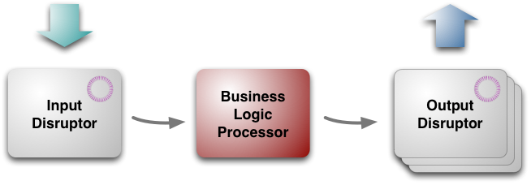
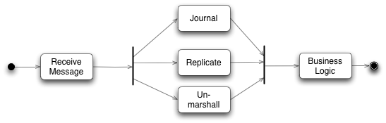
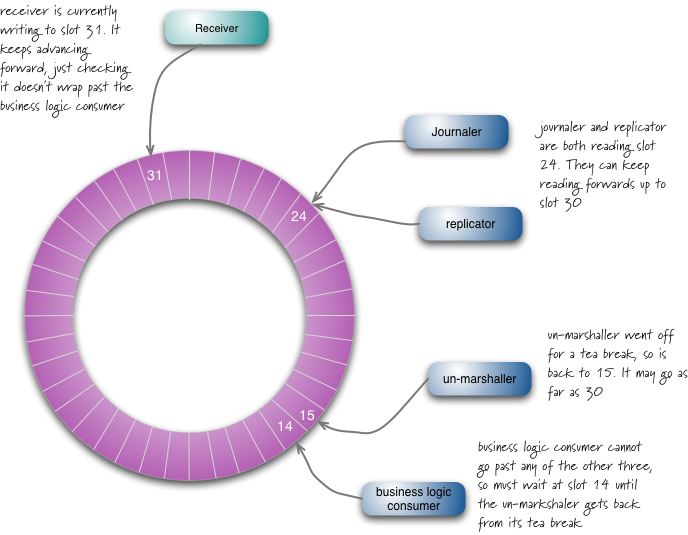
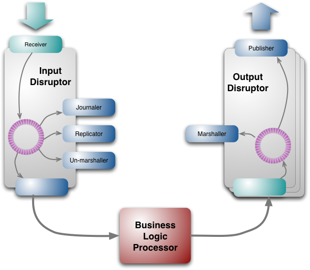

LMAX架构
原文地址：http://martinfowler.com/articles/lmax.html 

作者：[Martin Fowler](http://www.martinfowler.com/)

译文地址：http://www.jdon.com/42452 译者：banq

LMAX 是一种新型零售金融交易平台，它能够以很低的延迟(latency)产生大量交易(吞吐量). 这个系统是建立在 JVM 平台上，核心是一个业务逻辑处理器，它能够在一个线程里每秒处理 6 百万订单. 业务逻辑处理器完全是运行在内存中(in-memory)，使用事件源驱动方式(event sourcing). 业务逻辑处理器的核心是 Disruptors，这是一个并发组件，能够在无锁的情况下实现网络的 Queue 并发操作。他们的研究表明，现在的所谓高性能研究方向似乎和现代 CPU 设计是相左的。

**目录**

1. 整体架构
2. 业务逻辑处理
3. Disruptors 的输入和输出
4. 队列和机制偏爱的缺乏
5. 你需要使用这个架构吗
 

过去几年我们不断提供这样声音：免费午餐已经结束。我们不再能期望在单个 CPU 上获得更快的性能，因此我们需要写使用多核处理的并发软件，不幸的是， 编写并发软件是很难的，锁和信号量是很难理解的和难以测试，这意味着我们要花更多时间在计算机上，而不是我们的领域问题，各种并发模型，如 Actors 和软事务 STM(Software Transactional Memory), 目的是更加容易使用，但是按下葫芦飘起瓢，还是带来了 bugs 和复杂性.

我很惊讶听到去年 3 月 QCon 上一个演讲， LMAX 是一种新的零售的金融交易平台。它的业务创新 – 允许任何人在一系列的金融衍生产品交易。这就需要非常低的延迟，非常快速的处理，因为市场变化很快，这个零售平台因为有很多人同时操作自然具备了复杂性，用户越多，交易量越大，不断快速增长。

鉴于多核心思想的转变，这种苛刻的性能自然会提出一个明确的并行编程模型 ，但是他们却提出用一个线程处理 6 百万订单，而且是每秒，在通用的硬件上。

通过低延迟处理大量交易，取得低延迟和高吞吐量，而且没有并发代码的复杂性，他们是怎么做到呢？现在 LMAX 已经产品化一段时间了，现在应该可以揭开其神秘而迷人的面纱了。

##整体结构
结构如图：

（图一：LMAX 架构的三大块）

 从最高层次看，架构有三个部分：

* 业务逻辑处理器 business logic processor[5]
* 输入 input disruptor
* 输出 output disruptors

业务逻辑处理器处理所有的应用程序的业务逻辑，这是一个单线程的 Java 程序，纯粹的方法调用，并返回输出。不需要任何平台框架，运行在 JVM 里，这就保证其很容易运行测试环境。

Although the Business Logic Processor can run in a simple environment for testing, there is rather more involved choreography to get it to run in a production setting. Input messages need to be taken off a network gateway and unmarshaled, replicated and journaled. Output messages need to be marshaled for the network. These tasks are handled by the input and output disruptors. Unlike the Business Logic Processor, these are concurrent components, since they involve IO operations which are both slow and independent. They were designed and built especially for LMAX, but they (like the overall architecture) are applicable elsewhere.

##业务逻辑处理器
###全部驻留在内存中
业务逻辑处理器有次序地取出消息，然后运行其中的业务逻辑，然后产生输出事件，整个操作都是在内存中，没有数据库或其他持久存储。将所有数据驻留在内存中有两个重要好处：首先是快，没有 IO，也没有事务，其次是简化编程，没有对象/关系数据库的映射，所有代码都是使用 Java 对象模型(广告：开源框架 Jdonframework 和 JiveJdon 也是全部基于内存和事件源，内存领域对象+事件驱动，看来这条路的方向是对的)。

使用基于内存的模型有一个重要问题：万一崩溃怎么办？电源掉电也是可能发生的，“事件”(Event Sourcing )概念是问题解决的核心，业务逻辑处理器的状态是由输入事件驱动的，只要这些输入事件被持久化保存起来，你就总是能够在崩溃情况下，根据事件重演重新获得当前状态。(NOSQL 存储的基于事件的事务实现)

要很好理解这点可以通过版本控制系统来理解，版本控制系统提交的序列，在任何时候，你可以建立由申请者提交一个工作拷贝，版本控制系统是一个复杂的商业逻辑处理器，而这里的业务逻辑处理只是一个简单的序列。

因此，从理论上讲，你总是可以通过后处理的所有事件的商业逻辑处理器重建的状态，但是实践中重建所有事件是耗时的，需要切分，LMAX 提供业务逻辑处理的快照，从快照还原，每天晚上系统不繁忙时构建快照，重新启动商业逻辑处理器的速度很快，一个完整的重新启动 – 包括重新启动 JVM 加载最近的快照，和重放一天事件 – 不到一分钟。

快照虽然使启动一个新的业务逻辑处理器的速度，但速度还不够快，业务逻辑处理器在下午2时就非常繁忙甚至崩溃，LMA X就保持多个业务逻辑处理器同时运行，每个输入事件由多个处理器处理，只有一个处理器输出有效，其他忽略，如果一个处理器失败，切换到另外一个，这种故障转移失败恢复是事件源驱动(Event Sourcing)的另外一个好处。

通过事件驱动(event sourcing)他们也可以在处理器之间以微秒速度切换，每晚创建快照，每晚重启业务逻辑处理器， 这种复制方式能够保证他们没有当机时间，实现 24/7.

事件方式是有价值的因为它允许处理器可以完全在内存中运行，但它有另一种用于诊断相当大的优势：如果出现一些意想不到的行为，事件副本们能够让他们在开发环境重放生产环境的事件，这就容易使他们能够研究和发现出在生产环境到底发生了什么事。

这种诊断能力延伸到业务诊断。有一些企业的任务，如在风险管理，需要大量的计算，但是不处理订单。一个例子是根据其目前的交易头寸的风险状况排名前 20 位客户名单，他们就可以切分到复制好的领域模型中进行计算，而不是在生产环境中正在运行的领域模型，不同性质的领域模型保存在不同机器的内存中，彼此不影响。

###性能优化
正如我解释，业务逻辑处理器的性能关键是按顺序地做事(其实并不愚蠢 并行做就聪明吗？)，这可以让普通开发者写的代码处理 10K TPS. 如果能精简代码能够带来 100K TPS提升. 这需要良好的代码和小方法，当然， JVM Hotspot 的缓存微调，让其更加优化也是必须的。

以下两段未翻译…….调试方面。

It took a bit more cleverness to go up another order of magnitude. There are several things that the LMAX team found helpful to get there. One was to write custom implementations of the java collections that were designed to be cache-friendly and careful with garbage[8]. An example of this is using primitive java longs as hashmap keys with a specially written array backed Map implementation (LongToObjectHashMap). In general they’ve found that choice of data structures often makes a big difference, Most programmers just grab whatever List they used last time rather than thinking which implementation is the right one for this context.[9]

Another technique to reach that top level of performance is putting attention into performance testing. I’ve long noticed that people talk a lot about techniques to improve performance, but the one thing that really makes a difference is to test it. Even good programmers are very good at constructing performance arguments that end up being wrong, so the best programmers prefer profilers and test cases to speculation.[10] The LMAX team has also found that writing tests first is a very effective discipline for performance tests.

###编程模型
以一个简单的非 LMAX 的例子来说明。想象一下，你正在为糖豆使用信用卡下订单。一个简单的零售系统将获取您的订单信息，使用信用卡验证服务，以检查您的信用卡号码，然后确认您的订单 – 所有这些都在一个单一过程中操作。当进行信用卡有效性检查时，服务器这边的线程会阻塞等待，当然这个对于用户来说停顿不会太长。

在 MAX 架构中，你将此单一操作过程分为两个，第一部分将获取订单信息，然后输出事件(请求信用卡检查有效性的请求事件)给信用卡公司. 业务逻辑处理器将继续处理其他客户的订单，直至它在输入事件中发现了信用卡已经检查有效的事件，然后获取该事件来确认该订单有效。

这种异步事件驱动方式确实不寻常，虽然使用异步提高应用程序的响应是一个熟悉的技术。它还可以帮助业务流程更弹性，因为你必须要更明确的思考与远程应用程序打交道的不同之处。

这个编程模型第二个特点在于错误处理。传统模式下会话和数据库事务提供了一个有用的错误处理能力。如果有什么出错，很容易抛出任何东西，这个会话能够被丢弃。如果一个错误发生在数据库端，你可以回滚事务。

LMAX 的内存模式(in-memory structures)在于持久化输入事件，如果有错误发生也不会从内存中离开造成不一致的状态。但是因为没有回滚机制，LMAX 投入了更多精力，确保输入事件在实施任何内存状态影响前有效地持久化，他们发现这个关键是测试，在进入生产环境之前尽可能发现各种问题，确保持久化有效。

##Disruptors 的输入和输出
尽管业务逻辑是在单个线程中实现的，但是在我们调用一个业务对象方法之前，有很多任务需要完成. 原始输入来自于消息形式，这个消息需要恢复成业务逻辑处理器能够处理的形式。事件源 Event Sourcing 依赖于让所有输入事件持久化，这样每个输入消息需要能够存储到持久化介质上，最后整个架构还有赖于业务逻辑处理器的集群. 同样在输出一边，输出事件也需要进行转换以便能够在网络上传输。

如图复制和日志是比较慢的。所有业务逻辑处理器避免最任何 IO 处理，所有这些任务都应该相对独立，他们需要在业务逻辑处理器处理之前完成，它们可以以任何次序方式完成，这不同意业务逻辑处理器需要根据交易自然先后进行交易,这些都是需要的并发机制。

为了这个并发机制，他们开发了 disruptor 的开源组件。

Disruptor 可以看成一个事件监听或消息机制，在队列中一边生产者放入消息，另外一边消费者并行取出处理. 当你进入这个队列内部查看，发现其实是一个真正的单个数据结构：一个 ring buffer. 每个生产者和消费者都有一个次序计算器，以显示当前缓冲工作方式.每个生产者消费者写入自己次序计数器，能够读取对方的计数器，生产者能够读取消费者的计算器确保其在没有锁的情况下是可写的，类似地消费者也要通过计算器在另外一个消费者完成后确保它一次只处理一次消息。

输出 disruptors 也类似于此，但是只有两个有顺序的消费者，转换和输出。输出事件被组织进入几个 topics, 这样消息能够被发送到只有感兴趣的 topic 中，每个 topi c有自己的 disruptor.

disruptor 不但适合一个生产者多个消费者，也适合多个生产者。

disruptor 设计的好处是能够容易让消费者快速抓取，如果发生问题，比如在 15 号位置有一个转换问题，而接受者在 31 号，它能够从 16-30 号一次性批量抓取，这种数据批读取能力加快消费者处理，降低整体延迟性。

ring buffe r是巨大的: 输入 2 千万号槽；4 百万输出. 次序计算器是一个64bit long 整数型，平滑增长(banq注：大概这里发现了 JVM 的伪共享)，象其他系统一样 disruptors 过一个晚上将被清除，主要是擦除内存，以便不会产生代价昂贵的垃圾回收机制启动(我认为重启是一个好的习惯，以便你应付不时之需。)

日志工作是将事件存储到持久化介质上，以便出错是重放，但是他们没有使用数据库来实现，而是文件系统，他们将事件流写到磁盘上，在现代概念看来，磁盘对于随机访问是非常慢，但是对于流操作却很快，也就是说，磁盘是一种新式的磁带。

之前我提到 LMAX 运行在集群多个系统拷贝能够支持失败回复，复制工作负责这些节点的同步，所有节点联系是 IP 广播, 这样客户端能够不需要知道主节点的 IP 地址. 只有主节点直接听取输入事件，然后运行一个复制工作者，复制工作者将把输入事件广播到其他次要节点. 如果主节点当机，心跳机制将会发现， 另外一个节点就成为主节点，开始处理输入事件，启动复制工作者，每个节点都有自己的输入 disruptor 这样它有自己的日志处理和格式转换。

即使有 IP 广播，复制还是需要的，因为 IP 消息是以不同顺序到达不同节点，主节点提供为其他处理提供一个确定顺序。

格式转换 unmarshaler 是将事件从其消息格式转换到 Java 对象，这样才能在业务逻辑处理器中使用，不同于其他消费者，它需要修改 ring buffer中的数据以便能够存入这个被转换好的 Java 对象，这里有一个规则：并发地每次只有一个消费者能够运行写入，这实际上也符合单一写入者原则。

disruptor 组件可以用在 LMAX 系统以外，通常金融财务公司对他们的系统都保持隐秘，但是 LMAX 能够开源，我很高兴，这将允许其他组织使用 disruptor，它也将允许其他人对其进行并发性能测试。
(banq注：disruptor看来是一种特殊的消息组件类似JMS东西)。

##队列和机制偏爱的缺乏
LMAX 架构引起了人们的关注，因为它是一个非常不同的方式接近的高性能系统。到目前为止，我已经谈到了它是如何工作的，但没有太多深入探讨了为什么它是这样。这个故事本身是有趣的，意识到他们是有缺陷的。

许多商业系统都有自己的核心架构师，通过事务性数据库实现多个会话事务(banq注：如EJB或Spring JTA等等)，LMAX 团队也熟悉这些知识，但是确信这些不合适他们的系统。这个经验是建立在 LMAX 母公司 Betfair上 – 这是一家体育博彩公司，它处理很多人的体育投赌事件，这是一个相当大的并发访问，传统数据库机制几乎无法应付，这些让他们相信必须寻找另外一个途径来突破，他们现在接近目标了。

他们最初的想法为获得高性能是使用现在流行的并发。这意味着允许多线程并行处理多个订单。然而，在这种情况下是很难实现的，因为这些线程必须互相沟通。处理订单变化的市场条件等都需要相互沟通。

早期他们探索了 Actor 模型和近亲 SEDA. Actor 模型依赖于独立，活跃的对象有其自己的线程，彼此之间是通过 queue 同学，很多人认为这种并发模型比基于原始锁的方式易于处理。

这团队就建立了一个 actor 模型原型，进行性能测试，他们发现的是处理器会花费更多时间在管理队列，而不是去做真正应用逻辑，队列访问成了真正瓶颈(banq注：Scala 的 Actor 模型很有名，不知这是否算 Scala 致命问题，怪不得很少人谈 Scala 的 Actor 模型了).

当追求性能达到这种程度，现代硬件构造原理成为很重要的必须了解的知识了，马丁汤普森喜欢用的一句话是“机制偏爱”，这词来自赛车驾驶，它反映的是赛车手对汽车有一种与生俱来的感觉，使他们能够感受到如何发挥它到最好状态。许多程序员包括我承认我也陷入这样一个阵营：不会认为编程如何与硬件等底层机制交互是值得研究的。

现代的 CPU 延迟是影响性能的主导因素之一，在 CPU 如何与内存交互， CPU 具有多层次的缓存（一级二级），每级速度都明显加快。因此，如果要提高速度，将您的代码和数据加载到这些缓存中。

在某个层次, actor 模型能够帮助你，你能认为 actor 可以作为集群节点，是缓存的自然单元。但是 actors 需要相互联系, 这是通过队列的- 而 LMAX 团队发现队列会干扰缓存(banq 注：JVM 伪分享的问题)。

为什么队列干扰了缓存呢？解释是这样的: 为了将数据放入队列，你需要写入队列，类似地，为了从队列取出数据，你需要移除队列也是一种写，客户端也许不只一次写入同样数据结构，处理写通常需要锁，但是如果锁使用了，会引起切换到底层系统的场景， 当这个发生后，处理器会丢失它的缓存中的数据。

他们得出的结论能够获得最好的缓存性能, 你需要设计一个 CPU 核写任何内存，多个读是好的，处理器会非常快，而队列失败在 one-writer 原则。

这样的分析导致 LMAX 团队得出一系列结论，导致他们设计出 disruptor, 能够遵循 single-writer 约束. 其次它导向留澳单个线程处理业务逻辑的新的目标, 问题是：一个线程如果从并发管理结构中脱离出来(没有锁机制)，它到底能跑多快？

单个线程的本质是：确保你每个 CPU 核运行一个线程，缓存配合，尽可能的高速缓存访问甚于主内存。这就意味着代码和数据需要尽可能的一致，. 保持小的代码对象和数据在一起，以便允许他们能够调入到一个高速缓存单位中或者轮换，简化高速缓存管理就是提高性能。

LMAX 架构的路径的一个重要组成部分是使用了性能测试。基于 actor 模型的放弃也是来自于测试原型的性能。同时也为改善的各个组成部分的性能步骤，启用了性能测试。机械同情是非常宝贵的的 – 它有助于形成假设什么可以改进，并指导你前进 -最终测试提供了有说服力的证据。

两段关于性能测试重要性，忽略….

###你应当使用者架构吗？
这个架构是适合非常小小众，必须有很低的延迟获得复杂大量的交易，大多数应用并不需要 6 百万 TPS。

但是我对这个架构着迷的原因是它的设计，它移除了很多其他大多数编程系统的复杂性，传统围绕事务性的关系数据库会话并发模型是不是免费的麻烦？(banq注：因为都掌握都知道也就是免费的) 通常与数据库打交道都有不寻常的付出和努力，对象/关系数据库映射 ORM 工具Object/relational mapping tools 能够帮助减轻不少这种痛苦，但是它不能解决全部问题，大多数企业性能微调还是要纠结于 SQL.

现在你能得到服务器更多的主内存，比我们过去这些老家伙得到的磁盘还要多，越来越多应用能够将他们的工作全部置于内存中，这样消除了复杂性和性能低问题. 事件源驱动 Event Sourcing 提供了一种内存 in-memory 系统的解决方案, 在单个线程运行业务解决了并发. LMAX 经验建议只要你需要少于几百万 TPS，你就有足够的性能提升余地。

这里也是相似于 CQRS. 一种事件驱动, in-memory 风格自然的命令系统(尽管 LMAX 当前没有使用 CQRS.)

那么表示你是不是不应该走上这条道路呢？始终存在这样鲜为人知的棘手的技术问题，这个行业需要更多的时间去探索它的边界(注：老子思想的缴啊)。基本出发点是鼓励有自己特点的架构。

一个重要特点是处理一个交易总是潜在地影响其后面的处理方式，因为交易总是相互独立的, 因为很少相互协调，那么使用分离单独处理器分别处理并发运行也许更加有吸引力。

LMAX 指出了“事件”概念是如何改变世界(banq注：hold住事件，而不是 hold 住数据，你就上了一个新层次，摆脱低级趣味的数据库癖好)。 许多网站使用原有的信息存储系统，然后渲染各种能够吸引眼球的效果. 他们的架构挑战就是如何正确使用缓存。

LMAX 另外一个特点是这是一个后台系统，有理由考虑如何在一个交互模型中应用它，比如日益增长的 Web 应用，当异步通讯在 WEB 应用越来越多时，这将改变我们的编程模型。

这个改变会影响很多团队，大多数人倾向于认为同步编程，不习惯于异步处理。异步通讯是必不可少的响应工具，在 javascript 世界已经广泛使用，如 AJAX 和 node.js, 这些鼓励人们研究这些风格. LMAX 团队发现虽然要花费一定时间来适应异步编程模型，但是一旦习惯就成为自然，特别是错误处理上容易得多。

LMAX 团队当然感觉到花力气协调事务性关系数据库的日子已经屈指可数(banq 老泪纵横啊，05 年喊出了数据库时代的终结，08 年我就喊出数据库已死，被国内很多大牛讥笑为疯子) 。你可以使用一种更加容易方式编写程序而且比传统集中式中央数据库运行得更快，为什么视而不见呢？

从我的观点看，我发现了一个令人激动的故事，我的大多数目标集中在软件的复杂领域模型解决上，作为一个架构师很喜欢这样的分离关注：让人们关注领域驱动设计 DDD Domain-Driven Design，同时很好分离了平台复杂性，领域对象和数据库的紧耦合总是如一根针刺激我，现在好像找到出路了。
