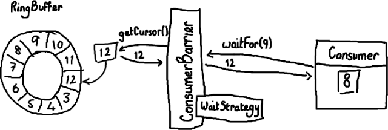

#如何从Ringbuffer读取

英文原文：<http://ifeve.com/dissecting-the-disruptor-how-do-i-read-from-the-ring-buffer/>

作者：Trisha  译者：古圣昌  校对：方腾飞

从[上一篇文章](ringbuffer-special.md)中我们都了解了什么是 Ring Buffer 以及它是如何的特别。但遗憾的是，我还没有讲述如何使用 Disruptor 向 Ring Buffe r写数据和从 Ring Buffer 中读取数据。


##ConsumerBarrier 与消费者
这里我要稍微反过来介绍，因为总的来说读取数据这一过程比写数据要容易理解。假设通过一些“魔法”已经把数据写入到 Ring Buffer了，怎样从 Ring Buffer 读出这些数据呢？

(好，我开始后悔使用 Paint/Gimp 了。尽管这是个购买绘图板的好借口，如果我继续写下去的话… UML 界的权威们大概也在诅咒我的名字了。)

消费者(Consumer)是一个想从 Ring Buffer 里读取数据的线程，它可以访问 ConsumerBarrie r对象——这个对象由 RingBuffer 创建并且代表消费者与 RingBuffer 进行交互。就像 Ring Buffe r显然需要一个序号才能找到下一个可用节点一样，消费者也需要知道它将要处理的序号——每个消费者都需要找到下一个它要访问的序号。在上面的例子中，消费者处理完了 Ring Buffer 里序号8之前（包括 8）的所有数据，那么它期待访问的下一个序号是 9。

消费者可以调用 ConsumerBarrier 对象的 waitFor() 方法，传递它所需要的下一个序号.


```
final long availableSeq = consumerBarrier.waitFor(nextSequence);
```

ConsumerBarrier 返回 RingBuffer 的最大可访问序号——在上面的例子中是12。ConsumerBarrier 有一个 WaitStrategy 方法来决定它如何等待这个序号，我现在不会去描述它的细节，代码的注释里已经概括了每一种 WaitStrategy 的优点和缺点 。

##接下来怎么做？
接下来，消费者会一直原地停留，等待更多数据被写入Ring Buffer。并且，一旦数据写入后消费者会收到通知——节点 9，10，11和12 已写入。现在序号 12 到了，消费者可以让 ConsumerBarrier 去拿这些序号节点里的数据了。


拿到了数据后，消费者(Consumer)会更新自己的标识(cursor)。

你应该已经感觉得到，这样做是怎样有助于平缓延迟的峰值了——以前需要逐个节点地询问“我可以拿下一个数据吗？现在可以了么？现在呢？”，消费者(Consumer)现在只需要简单的说“当你拿到的数字比我这个要大的时候请告诉我”，函数返回值会告诉它有多少个新的节点可以读取数据了。因为这些新的节点的确已经写入了数据（Ring Buffer本身的序号已经更新），而且消费者对这些节点的唯一操作是读而不是写，因此访问不用加锁。这太好了，不仅代码实现起来可以更加安全和简单，而且不用加锁使得速度更快。

另一个好处是——你可以用多个消费者(Consumer)去读同一个RingBuffer ，不需要加锁，也不需要用另外的队列来协调不同的线程(消费者)。这样你可以在 Disruptor 的协调下实现真正的并发数据处理。

BatchConsumer 代码是一个消费者的例子。如果你实现了BatchHandler, 你可以用 BatchConsumer 来完成上面我提到的复杂工作。它很容易对付那些需要成批处理的节点（例如上文中要处理的9-12节点）而不用单独地去读取每一个节点。

更新：注意 Disruptor 2.0版本使用了与本文不一样的命名。如果你对类名感到困惑，请阅读我的[变更总结](http://ifeve.com/disruptor-2-change/)。

原创文章，转载请注明： 转载自[并发编程网 – ifeve.com](http://ifeve.com/)

本文链接地址: [如何使用Disruptor（二）如何从Ringbuffer读取](http://ifeve.com/dissecting_the_disruptor_how_doi_read_from_the_ring_buffer/)
