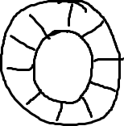
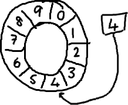
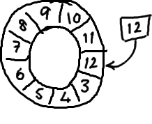
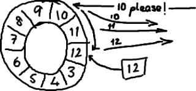

#Ringbuffer的特别之处
原文地址：<http://ifeve.com/ringbuffer/>

作者：Trisha    译者：寒桐  校对：方腾飞

最近，我们开源了 [LMAX Disruptor](http://lmax-exchange.github.com/disruptor/)，它是我们的交易系统吞吐量快（LMAX 是一个新型的交易平台，号称能够单线程每秒处理数百万的订单）的关键原因。为什么我们要将其开源？我们意识到对高性能编程领域的一些传统观点，有点不对劲。我们找到了一种更好、更快地在线程间共享数据的方法，如果不公开于业界共享的话，那未免太自私了。同时开源也让我们觉得看起来更酷。

从这个[站点](http://lmax-exchange.github.com/disruptor/)，你可以下载到一篇解释什么是 Disruptor 及它为什么如此高性能的文档。这篇文档的编写过程，我并没有参与太多，只是简单地插入了一些标点符号和重组了一些我不懂的句子，但是非常高兴的是，我仍然从中提升了自己的写作水平。

我发现要把所有的事情一下子全部解释清楚还是有点困难的，所有我准备一部分一部分地解释它们，以适合我的 [NADD](http://www.randsinrepose.com/archives/2003/07/10/nadd.html) 听众。

首先介绍 ringbuffer。我对 Disruptor 的最初印象就是 ringbuffer。但是后来我意识到尽管 ringbuffer 是整个模式（Disruptor）的核心，但是 Disruptor 对 ringbuffer 的访问控制策略才是真正的关键点所在。


##ringbuffer 到底是什么？
嗯，正如名字所说的一样，它是一个环（首尾相接的环），你可以把它用做在不同上下文（线程）间传递数据的 buffer。



（好吧，这是我通过画图板手画的，我试着画草图，希望我的强迫症不会让我画完美的圆和直线）

基本来说，ringbuffer 拥有一个序号，这个序号指向数组中下一个可用的元素。（校对注：如下图右边的图片表示序号，这个序号指向数组的索引4的位置。）



随着你不停地填充这个 buffer（可能也会有相应的读取），这个序号会一直增长，直到绕过这个环。



要找到数组中当前序号指向的元素，可以通过 mod 操作：

```
 sequence mod array length = array index
```

以上面的 ringbuffer 为例（java 的 mod 语法）：12 % 10 = 2。很简单吧。

事实上，上图中的 ringbuffer 只有 10 个槽完全是个意外。如果槽的个数是 2 的 N 次方更有利于基于二进制的计算机进行计算。

（校对注：2 的 N 次方换成二进制就是 1000，100，10，1 这样的数字， sequence & （array length－1） = array index，比如一共有8槽，3&（8－1）=3，HashMap 就是用这个方式来定位数组元素的，这种方式比取模的速度更快。）

##那又怎么样？
如果你看了维基百科里面的关于[环形 buffer](http://en.wikipedia.org/wiki/Circular_buffer) 的词条，你就会发现，我们的实现方式，与其最大的区别在于：没有尾指针。我们只维护了一个指向下一个可用位置的序号。这种实现是经过深思熟虑的—我们选择用环形 buffer 的最初原因就是想要提供可靠的消息传递。我们需要将已经被服务发送过的消息保存起来，这样当另外一个服务通过 nak (校对注：拒绝应答信号)告诉我们没有成功收到消息时，我们能够重新发送给他们。

听起来，环形 buffer 非常适合这个场景。它维护了一个指向尾部的序号，当收到 nak (校对注：拒绝应答信号)请求，可以重发从那一点到当前序号之间的所有消息：



我们实现的 ring buffe r和大家常用的队列之间的区别是，我们不删除 buffer 中的数据，也就是说这些数据一直存放在 buffer 中，直到新的数据覆盖他们。这就是和维基百科版本相比，我们不需要尾指针的原因。 ringbuffer 本身并不控制是否需要重叠（决定是否重叠是生产者-消费者行为模式的一部分–如果你等不急我写 blog 来说明它们，那么可以自行检出 [Disruptor 项目](https://code.google.com/p/disruptor/)）。

##它为什么如此优秀？
之所以 ringbuffer 采用这种数据结构，是因为它在可靠消息传递方面有很好的性能。这就够了，不过它还有一些其他的优点。

首先，因为它是数组，所以要比链表快，而且有一个容易预测的访问模式。（译者注：数组内元素的内存地址的连续性存储的）。这是对 CPU 缓存友好的—也就是说，在硬件级别，数组中的元素是会被预加载的，因此在 ringbuffer 当中，cpu 无需时不时去主存加载数组中的下一个元素。（校对注：因为只要一个元素被加载到缓存行，其他相邻的几个元素也会被加载进同一个缓存行）

其次，你可以为数组预先分配内存，使得数组对象一直存在（除非程序终止）。这就意味着不需要花大量的时间用于垃圾回收。此外，不像链表那样，需要为每一个添加到其上面的对象创造节点对象—对应的，当删除节点时，需要执行相应的内存清理操作。

##缺少的部分
我并没有在本文中介绍如何避免 ringbuffer 产生重叠，以及如何对 ringbuffer 进行读写操作。你可能注意到了我将 ringbuffer 和链表那样的数据结构进行比较，因为我并认为链表是实际问题的标准答案。

当你将 Disruptor 和基于 队列之类的实现进行比较时，事情将变得很有趣。队列通常注重维护队列的头尾元素，添加和删除元素等。所有的这些我都没有在 ringbuffer 里提到，这是因为 ringbuffer 不负责这些事情，我们把这些操作都移到了数据结构（ringbuffer）的外部

到这个[站点](https://code.google.com/p/disruptor/)阅读文章或者检出代码可以了解更多细节。或者观看 Mike 和 Martin 在去年 [San Francisco QCon 大会上的视频](http://www.infoq.com/presentations/LMAX)，或者再等我一些时间来思考剩下的东西，然后在接下来的 blog 中逐一介绍。

原创文章，转载请注明： [转载自并发编程网 – ifeve.com](http://ifeve.com/)

本文链接地址: [剖析Disruptor:为什么会这么快？（一）Ringbuffer的特别之处](http://ifeve.com/dissecting-disruptor-whats-so-special/)
