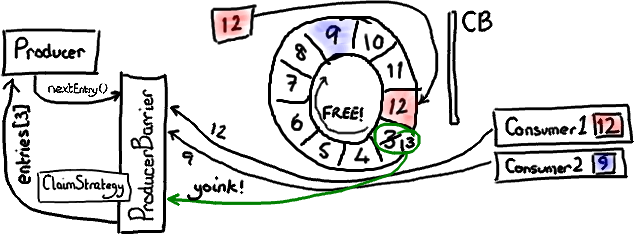
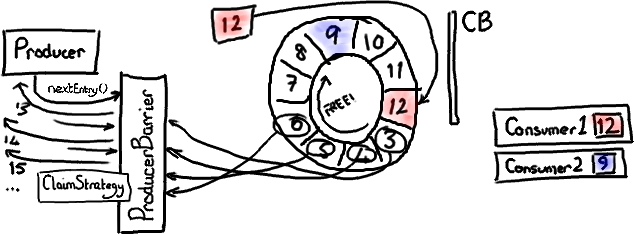
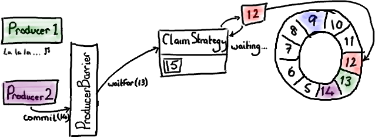
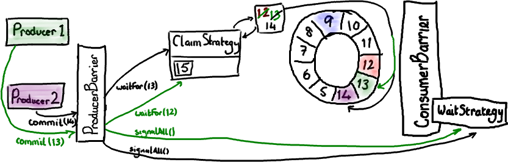

#写入 Ringbuffer
原文地址：<http://ifeve.com/dissecting-the-disruptor-writing-to-the-ring-buffer/>

作者：Trisha   译者：廖涵  校对：方腾飞

这是 Disruptor 全方位解析（end-to-end view）中缺少的一章。当心，本文非常长。但是为了让你能联系上下文阅读，我还是决定把它们写进一篇博客里。

本文的重点是：不要让 Ring 重叠；如何通知消费者；生产者一端的批处理；以及多个生产者如何协同工作。

##ProducerBarriers

[Disruptor 代码​](http://code.google.com/p/disruptor/)给**消费者**提供了一些接口和辅助类，但是没有给写入 Ring Buffer 的**生产者**提供接口。这是因为除了你需要知道生产者之外，没有别人需要访问它。尽管如此，Ring Buffer 还是与消费端一样提供了一个 ProducerBarrier 对象，让生产者通过它来写入 Ring Buffer。

写入 Ring Buffer 的过程涉及到两阶段提交 (two-phase commit)。首先，你的生产者需要申请 buffer 里的下一个节点。然后，当生产者向节点写完数据，它将会调用 ProducerBarrier 的 commit 方法。

那么让我们首先来看看第一步。 “给我 Ring Buffer 里的下一个节点”，这句话听起来很简单。的确，从生产者角度来看它很简单：简单地调用 ProducerBarrier 的 nextEntry() 方法，这样会返回给你一个 Entry 对象，这个对象就是 Ring Buffer 的下一个节点。

##ProducerBarrier 如何防止 Ring Buffer 重叠

在后台，由 ProducerBarrier 负责所有的交互细节来从 Ring Buffer 中找到下一个节点，然后才允许生产者向它写入数据。

（我不确定[闪闪发亮的新手写板​](http://www.amazon.com/Wacom-CTL460-Bamboo-Pen-Tablet/dp/B002OOWC3I?ie=UTF8&tag=trissramb-20&link_code=btl&camp=213689&creative=392969)能否有助于提高我画图片的清晰度，但是它用起来很有意思）。
在这幅图中，我们假设只有一个生产者写入 Ring Buffer。过一会儿我们再处理多个生产者的复杂问题。

**ConsumerTrackingProducerBarrier** 对象拥有所有正在访问 Ring Buffer 的 消费者 列表。这看起来有点儿奇怪－我从没有期望 ProducerBarrier 了解任何有关消费端那边的事情。但是等等，这是有原因的。因为我们不想与队列“混为一谈”（队列需要追踪队列的头和尾，它们有时候会指向相同的位置），Disruptor 由消费者负责通知它们处理到了哪个序列号，而不是 Ring Buffer。所以，如果我们想确定我们没有让 Ring Buffer 重叠，需要检查所有的消费者们都读到了哪里。

在上图中，有一个 消费者 顺利的读到了最大序号 12（用红色/粉色高亮）。第二个消费者 有点儿落后——可能它在做 I/O 操作之类的——它停在序号 3。因此消费者 2 在赶上消费者 1 之前要跑完整个 Ring Buffer 一圈的距离。

现在生产者想要写入 Ring Buffer 中序号 3 占据的节点，因为它是 Ring Buffer 当前游标的下一个节点。但是 ProducerBarrier 明白现在不能写入，因为有一个消费者正在占用它。所以，ProducerBarrier 停下来自旋 (spins)，等待，直到那个消费者离开。

##申请下一个节点

现在可以想像消费者 2 已经处理完了一批节点，并且向前移动了它的序号。可能它挪到了序号 9（因为消费端的批处理方式，现实中我会预计它到达 12，但那样的话这个例子就不够有趣了）。

上图显示了当消费者 2 挪动到序号 9 时发生的情况。在这张图中我已经忽略了 ConsumerBarrier，因为它没有参与这个场景。
ProducerBarier 会看到下一个节点——序号 3 那个已经可以用了。它会抢占这个节点上的 Entry（我还没有特别介绍 Entry 对象，基本上它是一个放写入到某个序号的 Ring Buffer 数据的桶），把下一个序号（13）更新成 Entry 的序号，然后把 Entry 返回给生产者。生产者可以接着往 Entry 里写入数据。

##提交新的数据

两阶段提交的第二步是——对，提交。

绿色表示最近写入的 Entry，序号是 13 ——厄，抱歉，我也是红绿色盲。但是其他颜色甚至更糟糕。
当生产者结束向 Entry 写入数据后，它会要求 ProducerBarrier 提交。

ProducerBarrier 先等待 Ring Buffer 的游标追上当前的位置（对于单生产者这毫无意义－比如，我们已经知道游标到了 12 ，而且没有其他人正在写入 Ring Buffer）。然后 ProducerBarrier 更新 Ring Buffer 的游标到刚才写入的 Entry 序号－在我们这儿是 13。接下来，ProducerBarrier 会让消费者知道 buffer 中有新东西了。它戳一下 ConsumerBarrier 上的 WaitStrategy 对象说－“喂，醒醒！有事情发生了！”（注意－不同的 WaitStrategy 实现以不同的方式来实现提醒，取决于它是否采用阻塞模式。）

现在消费者 1 可以读 Entry 13 的数据，消费者 2 可以读 Entry 13 以及前面的所有数据，然后它们都过得很 happy。

##ProducerBarrier 上的批处理

有趣的是 Disruptor 可以同时在生产者和 消费者​ 两端实现批处理。还记得伴随着程序运行，消费者 2 最后达到了序号 9 吗？ProducerBarrier 可以在这里做一件很狡猾的事－它知道 Ring Buffer 的大小，也知道最慢的消费者位置。因此它能够发现当前有哪些节点是可用的。

如果 ProducerBarrier 知道 Ring Buffer 的游标指向 12，而最慢的消费者在 9 的位置，它就可以让生产者写入节点 3，4，5，6，7 和 8，中间不需要再次检查消费者的位置。

##多个生产者的场景

到这里你也许会以为我讲完了，但其实还有一些细节。

在上面的图中我稍微撒了个谎。我暗示了 ProducerBarrier 拿到的序号直接来自 Ring Buffer 的游标。然而，如果你看过代码的话，你会发现它是通过 ClaimStrategy 获取的。我省略这个对象是为了简化示意图，在单个生产者的情况下它不是很重要。

在多个生产者的场景下，你还需要其他东西来追踪序号。这个序号是指当前可写入的序号。注意这和“向 Ring Buffer 的游标加 1”不一样－如果你有一个以上的生产者同时在向 Ring Buffer 写入，就有可能出现某些 Entry 正在被生产者写入但还没有提交的情况。

让我们复习一下如何申请写入节点。每个生产者都向 ClaimStrategy 申请下一个可用的节点。生产者 1 拿到序号 13，这和上面单个生产者的情况一样。生产者 2 拿到序号 14，尽管 Ring Buffer的当前游标仅仅指向 12。这是因为 ClaimSequence 不但负责分发序号，而且负责跟踪哪些序号已经被分配。

现在每个生产者都拥有自己的写入节点和一个崭新的序号。

我把生产者 1 和它的写入节点涂上绿色，把生产者 2 和它的写入节点涂上可疑的粉色－看起来像紫色。

现在假设生产者 1 还生活在童话里，因为某些原因没有来得及提交数据。生产者 2 已经准备好提交了，并且向 ProducerBarrier 发出了请求。

就像我们先前在 commit 示意图中看到的一样，ProducerBarrier 只有在 Ring Buffer 游标到达准备提交的节点的前一个节点时它才会提交。在当前情况下，游标必须先到达序号 13 我们才能提交节点 14 的数据。但是我们不能这样做，因为生产者 1 正盯着一些闪闪发光的东西，还没来得及提交。因此 ClaimStrategy 就停在那儿自旋 (spins)， 直到 Ring Buffer 游标到达它应该在的位置。

现在生产者 1 从迷糊中清醒过来并且申请提交节点 13 的数据（生产者 1 发出的绿色箭头代表这个请求）。ProducerBarrier 让 ClaimStrategy 先等待 Ring Buffer 的游标到达序号 12，当然现在已经到了。因此 Ring Buffer 移动游标到 13，让 ProducerBarrier 戳一下 WaitStrategy 告诉所有人都知道 Ring Buffer 有更新了。现在 ProducerBarrier 可以完成生产者 2 的请求，让 Ring Buffer 移动游标到 14，并且通知所有人都知道。

你会看到，尽管生产者在不同的时间完成数据写入，但是 Ring Buffer 的内容顺序总是会遵循 nextEntry() 的初始调用顺序。也就是说，如果一个生产者在写入 Ring Buffer 的时候暂停了，只有当它解除暂停后，其他等待中的提交才会立即执行。

呼——。我终于设法讲完了这一切的内容并且一次也没有提到内存屏障（Memory Barrier）。

**更新**：最近的 [RingBuffe](http://code.google.com/p/disruptor/source/browse/trunk/code/src/main/com/lmax/disruptor/RingBuffer.java?r=239)r​ 版本去掉了 Producer Barrier。如果在你看的代码里找不到 ProducerBarrier，那就假设当我讲“Producer Barrier”时，我的意思是“Ring Buffer”。

**更新2**：注意 Disruptor 2.0 版使用了与本文不一样的命名。如果你对类名感到困惑，请阅读我写的 [Disruptor 2.0](http://ifeve.com/disruptor-2-change/) 更新摘要​。

原创文章，转载请注明： 转载自[并发编程网 – ifeve.com](http://ifeve.com/)

本文链接地址: [如何使用 Disruptor（三）写入 Ringbuffer](http://ifeve.com/disruptor-writing-ringbuffer/)
